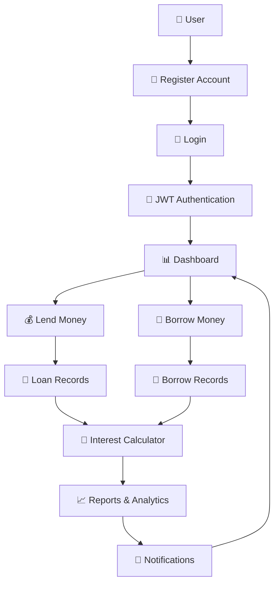
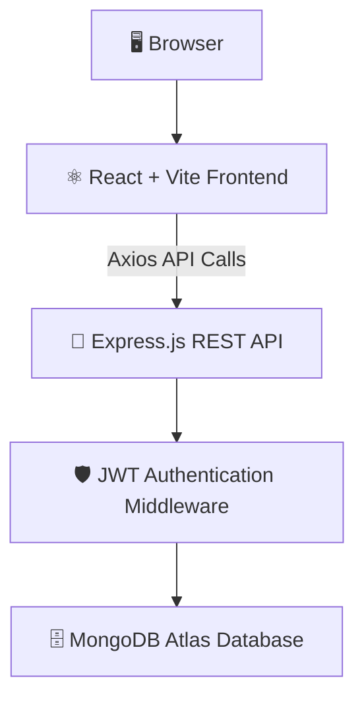
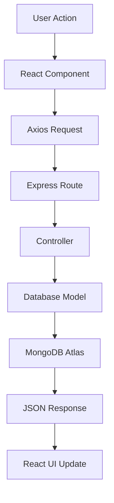
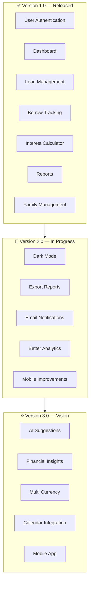

<div align="center">


<br/>


# 💰 LendTrack

### Smart Loan & Borrow Management System

*A modern full-stack MERN application that helps you effortlessly track money you've lent and borrowed — managing repayments, due dates, interest, and financial records through an intuitive, dashboard-first experience.*

<br/>

[](https://react.dev/)
[](https://vitejs.dev/)
[](https://nodejs.org/)
[](https://mongodb.com/)
[](#-security-features)
[](#-license)
[](#-user-interface-highlights)
[](#-project-highlights)
[](#-contributing)

<br/>

### 🌐 [**Live Demo → boobesh-lend-track.vercel.app**](https://boobesh-lend-track.vercel.app/)

[Live Demo](https://boobesh-lend-track.vercel.app/) · [Report Bug](../../issues) · [Request Feature](../../issues) · [Documentation](#-getting-started)

</div>

<br/>

---

<div align="center">

### 📸 Preview


*Replace this and other screenshots below after uploading real captures to `/assets`.*

</div>

<br/>

---

## 📖 About LendTrack

Managing money you've lent to friends, family, or colleagues can quickly become confusing. Notebooks, spreadsheets, and chat threads lead to missed repayments, forgotten due dates, and disorganized financial records.

**LendTrack** is a modern full-stack web application built to simplify personal loan management. It gives you a secure, intuitive platform to record, monitor, and manage both lending and borrowing transactions in one place — with dashboards, interest calculation, family management, and due-date reminders built right in.

<br/>

## ✨ Why LendTrack?

<div align="center">

| | | |
|:---:|:---:|:---:|
| 💰 **Track money lent** | 🤝 **Record money borrowed** | 📅 **Never miss a due date** |
| 📈 **Monitor financial summaries** | 🧮 **Calculate loan interest** | 👨‍👩‍👧 **Manage family-related loans** |
| 🔔 **Get repayment reminders** | 📊 **View insightful statistics** | 🔐 **Keep financial data secure** |

</div>

<br/>

## 🎯 Project Objectives

| Objective | Goal |
|---|---|
| ✔️ Simplify loan management | Replace notebooks/spreadsheets with a single source of truth |
| ✔️ Eliminate manual bookkeeping | Automate calculations and record-keeping |
| ✔️ Improve repayment tracking | Surface due dates and overdue amounts clearly |
| ✔️ Organize financial records | Group loans by contact, family, and status |
| ✔️ Deliver real-time insights | Dashboard + reports reflect live data |
| ✔️ Provide a modern UX | Clean, dashboard-first, mobile-ready interface |
| ✔️ Ensure secure authentication | JWT-based auth with encrypted passwords |
| ✔️ Support any device | Fully responsive across desktop, tablet, mobile |

<br/>

---

## 🚀 Core Features

<div align="center">

| Feature | Description |
|:---:|---|
| 🔐 **Authentication** | Secure user registration and login using JWT authentication |
| 📊 **Dashboard** | Complete financial summaries and quick statistics at a glance |
| 💸 **Loan Management** | Add, edit, update, and remove lending records |
| 💳 **Borrow Tracking** | Record borrowed money and monitor repayments |
| 🧮 **Interest Calculator** | Calculate interest and total payable amount |
| 👨‍👩‍👧 **Family Management** | Manage loans associated with family members |
| 🔔 **Notifications** | Track upcoming and overdue repayments |
| 📈 **Reports** | Analyze financial activity through summary reports |
| 📱 **Responsive Design** | Optimized experience across desktop, tablet & mobile |
| ⚡ **Fast Performance** | Built with React + Vite for smooth interactions |

</div>

<br/>

---

## 🎨 User Interface Highlights

LendTrack combines modern fintech-inspired aesthetics with practical usability.

<table>
<tr>
<td width="50%" valign="top">

**Design Language**
- ✨ Premium dashboard layout
- 📊 Clean, card-based financial summaries
- 🎯 Minimal, distraction-free interface
- 🌈 Modern gradients & accents
- 💎 Rounded, elevated components

</td>
<td width="50%" valign="top">

**Interaction & Feel**
- 📱 Mobile-first responsiveness
- 🖥️ Professional sidebar navigation
- 🎭 Smooth hover & focus effects
- ⚡ Fast, fluid page transitions
- 🎨 Consistent, purposeful color palette

</td>
</tr>
</table>

<br/>

---

## 🛠 Tech Stack

<div align="center">

**Frontend**


**Backend**


**Database**


**Deployment**


</div>

<br/>

<details>
<summary><strong>📊 Tech Stack Breakdown by Layer</strong></summary>

<br/>

**Frontend**

| Technology | Purpose |
|---|---|
| React.js | User Interface |
| Vite | Build Tool |
| React Router | Navigation |
| Axios | API Communication |
| CSS3 | Styling |
| React Icons | Icons |

**Backend**

| Technology | Purpose |
|---|---|
| Node.js | Runtime |
| Express.js | REST API |
| JWT | Authentication |
| bcrypt | Password Encryption |

**Database**

| Technology | Purpose |
|---|---|
| MongoDB Atlas | Cloud Database |
| Mongoose | Database ODM |

**Deployment**

| Service | Purpose |
|---|---|
| Vercel | Frontend Hosting |
| Render | Backend Hosting |
| MongoDB Atlas | Database Hosting |

</details>

<br/>

---

## 📂 Project Structure

The project follows a scalable MERN architecture, separating the frontend and backend into independent applications.

```text
LendTrack/
│
├── client/
│   ├── public/
│   ├── src/
│   │   ├── assets/
│   │   ├── components/
│   │   ├── layouts/
│   │   ├── pages/
│   │   ├── context/
│   │   ├── hooks/
│   │   ├── services/
│   │   ├── utils/
│   │   ├── App.jsx
│   │   └── main.jsx
│   │
│   ├── package.json
│   └── vite.config.js
│
├── server/
│   ├── config/
│   ├── controllers/
│   ├── middleware/
│   ├── models/
│   ├── routes/
│   ├── utils/
│   ├── package.json
│   └── server.js
│
├── README.md
└── .gitignore
```

<br/>

---

## ⚙️ Prerequisites

| Software | Version |
|---|---|
| Node.js | v18+ |
| npm | Latest |
| Git | Latest |
| MongoDB Atlas Account | Required |
| VS Code | Recommended |

<br/>

---

## 🚀 Getting Started

### 1️⃣ Clone the Repository

```bash
git clone https://github.com/BoobeshPalanisamy0612/LendTrack.git
cd LendTrack
```

### 2️⃣ Install Frontend Dependencies

```bash
cd client
npm install
```

### 3️⃣ Install Backend Dependencies

```bash
cd ../server
npm install
```

### 4️⃣ Configure Environment Variables

See [Environment Variables](#-environment-variables) below.

### 5️⃣ Run the Project

<table>
<tr>
<td valign="top">

**Start Backend**

```bash
cd server
npm run dev
```

Runs on:
```text
http://localhost:5000
```

</td>
<td valign="top">

**Start Frontend**

```bash
cd client
npm run dev
```

Runs on:
```text
http://localhost:5173
```

</td>
</tr>
</table>

<br/>

---

## 🔑 Environment Variables

<details>
<summary><strong>📁 Frontend (.env)</strong></summary>

```env
VITE_API_URL=http://localhost:5000/api
```

</details>

<details>
<summary><strong>📁 Backend (.env)</strong></summary>

```env
PORT=5000

MONGO_URI=your_mongodb_connection_string

JWT_SECRET=your_secret_key

CLIENT_URL=http://localhost:5173
```

</details>

> ⚠️ Never commit your `.env` file to GitHub.

<br/>

---

## 🔄 Application Workflow



<br/>

---

## 🏗️ System Architecture



<details>
<summary><strong>🔄 Request Lifecycle (detailed)</strong></summary>



</details>

<br/>

---

## 📡 REST API Overview

<details open>
<summary><strong>🔐 Authentication</strong></summary>

| Method | Endpoint | Description |
|---|---|---|
| `POST` | `/api/auth/register` | Register a new user |
| `POST` | `/api/auth/login` | Login user |
| `GET` | `/api/auth/profile` | Get logged-in user |

</details>

<details>
<summary><strong>📊 Dashboard</strong></summary>

| Method | Endpoint | Description |
|---|---|---|
| `GET` | `/api/dashboard` | Dashboard summary |

</details>

<details>
<summary><strong>💸 Loan Management</strong></summary>

| Method | Endpoint | Description |
|---|---|---|
| `GET` | `/api/loans` | Get all loans |
| `POST` | `/api/loans` | Add new loan |
| `PUT` | `/api/loans/:id` | Update loan |
| `DELETE` | `/api/loans/:id` | Delete loan |

</details>

<details>
<summary><strong>💳 Borrow Management</strong></summary>

| Method | Endpoint | Description |
|---|---|---|
| `GET` | `/api/borrow` | Get borrow records |
| `POST` | `/api/borrow` | Add borrow record |
| `PUT` | `/api/borrow/:id` | Update borrow |
| `DELETE` | `/api/borrow/:id` | Delete borrow |

</details>

<details>
<summary><strong>👨‍👩‍👧 Family Management</strong></summary>

| Method | Endpoint | Description |
|---|---|---|
| `GET` | `/api/family` | List family members |
| `POST` | `/api/family` | Add family member |
| `PUT` | `/api/family/:id` | Update member |
| `DELETE` | `/api/family/:id` | Remove member |

</details>

<details>
<summary><strong>🔔 Notifications & 📈 Reports</strong></summary>

| Method | Endpoint | Description |
|---|---|---|
| `GET` | `/api/notifications` | View notifications |
| `GET` | `/api/reports` | Financial reports |

</details>

<br/>

---

## 🗄 Database Collections

<table>
<tr>
<td valign="top" width="25%">

**Users**
- name
- email
- password
- createdAt

</td>
<td valign="top" width="25%">

**Loans**
- lender
- borrower
- amount
- interest
- dueDate
- status
- paymentHistory

</td>
<td valign="top" width="25%">

**Family**
- name
- relationship
- phone
- linkedLoans

</td>
<td valign="top" width="25%">

**Notifications**
- title
- message
- read
- createdAt

</td>
</tr>
</table>

<br/>

---

## 🔒 Security Features

| Measure | Description |
|---|---|
| 🔐 JWT Authentication | Stateless, token-based session management |
| 🛡️ Protected Routes | Sensitive endpoints gated behind valid tokens |
| 🔑 Password Hashing | Passwords encrypted using **bcrypt** |
| 🌐 Secure REST APIs | Consistent request/response contracts |
| 🧩 Authentication Middleware | Centralized token verification |
| ✅ Input Validation | Guards against malformed/malicious input |
| 🚫 MongoDB Injection Protection | Sanitized queries via Mongoose |
| 🗝️ Environment Variable Configuration | Secrets kept out of source control |
| ⏱️ Token-based Session Management | No server-side session storage required |

<br/>

---

## ⚡ Performance Optimizations

- ♻️ React component reusability
- ⚡ Fast Refresh with Vite
- 📡 Optimized API requests
- 🧱 Modular folder structure
- 🗄️ Efficient MongoDB queries
- 🪶 Lightweight UI components
- 📱 Responsive layout
- 🌀 Lazy component loading *(optional future enhancement)*

<br/>

---

## 🎨 Design Principles

| Principle | Description |
|---|---|
| 🎯 Minimal UI | No clutter — only what the user needs, when they need it |
| 📏 Consistent Spacing | Predictable visual rhythm across pages |
| 🧩 Responsive Grid Layout | Adapts fluidly across breakpoints |
| ♻️ Reusable Components | Shared UI primitives across the app |
| 🎨 Accessible Color Palette | Legible contrast for financial data |
| 🔤 Professional Typography | Clear hierarchy for numbers & labels |
| 💳 Modern Card Design | Digestible, elevated information blocks |
| 🧭 Intuitive Navigation | Predictable, low-friction user flows |
| 📊 Dashboard-first Experience | Key insights surfaced immediately on login |

<br/>

---

## 🧪 Testing Checklist

- [x] User Registration
- [x] User Login
- [x] Protected Routes
- [x] Loan CRUD Operations
- [x] Borrow CRUD Operations
- [x] Interest Calculator
- [x] Dashboard Statistics
- [x] Reports
- [x] Notifications
- [x] Responsive Design

<br/>

---

## 🖼️ Application Screens

> Add real screenshots inside the `/assets` folder to replace these placeholders.

| Screen | Path |
|---|---|
| 🏠 Home | `assets/home.png` |
| 🔐 Login | `assets/login.png` |
| 📝 Register | `assets/register.png` |
| 📊 Dashboard | `assets/dashboard.png` |
| 💸 Loan Management | `assets/loan-management.png` |
| 💳 Borrow Management | `assets/borrow-management.png` |
| 🧮 Calculator | `assets/calculator.png` |
| 👨‍👩‍👧 Family | `assets/family.png` |
| 📈 Reports | `assets/reports.png` |
| 🔔 Notifications | `assets/notifications.png` |

<br/>

---

## 🚀 Future Enhancements

| Feature | Status |
|---|:---:|
| 📱 Progressive Web App (PWA) | ⏳ Planned |
| 🌙 Dark Mode | ⏳ Planned |
| 💳 EMI Calculator | ⏳ Planned |
| 📅 Google Calendar Integration | ⏳ Planned |
| 📧 Email Payment Reminders | ⏳ Planned |
| 📲 SMS Notifications | ⏳ Planned |
| 📤 Export to Excel & PDF | ⏳ Planned |
| ☁️ Cloud File Attachments | ⏳ Planned |
| 💱 Multi-Currency Support | ⏳ Planned |
| 🌍 Multi-Language Support | ⏳ Planned |
| 📊 Advanced Analytics Dashboard | ⏳ Planned |
| 🤖 AI Payment Prediction | 🔮 Future Vision |
| 📈 Financial Health Score | 🔮 Future Vision |
| 🏦 Bank Account Integration | 🔮 Future Vision |
| 📱 Native Mobile Application | 🔮 Future Vision |

<br/>

---

## 🗺️ Development Roadmap



<br/>

---

## 🤝 Contributing

Contributions are welcome and greatly appreciated! Here's how to get started:

1. **Fork** this repository
2. **Create a feature branch**
   ```bash
   git checkout -b feature/AmazingFeature
   ```
3. **Commit your changes**
   ```bash
   git commit -m "Add Amazing Feature"
   ```
4. **Push to your branch**
   ```bash
   git push origin feature/AmazingFeature
   ```
5. **Open a Pull Request**

<details>
<summary><strong>📋 Coding Guidelines</strong></summary>

<br/>

- Follow consistent coding standards
- Keep components reusable and modular
- Write meaningful commit messages
- Test features before submitting
- Avoid unnecessary dependencies
- Maintain a clean folder structure
- Use descriptive variable and function names

</details>

<details>
<summary><strong>🐞 Found a Bug?</strong></summary>

<br/>

1. Search existing issues first
2. Create a new issue with detailed steps to reproduce
3. Include screenshots if applicable
4. Describe expected vs. actual behavior
5. Mention your browser and operating system

</details>

<details>
<summary><strong>💡 Have a Feature Request?</strong></summary>

<br/>

Open a Feature Request issue including:
- Problem description
- Proposed solution
- Expected benefits
- Optional mockups or wireframes

</details>

<br/>

---

## 📜 License

This project is licensed under the **MIT License**.

You are free to ✅ use · ✅ modify · ✅ distribute · ✅ fork · ✅ learn from this project.
Please retain the original license notice when redistributing.

<br/>

---

## 👨‍💻 Author

<div align="center">

## **Boobesh Palanisamy**

**UI/UX Designer • React Frontend Developer • MERN Stack Developer**

*Building modern, responsive, and user-friendly web applications with a passion for intuitive user experiences and scalable solutions.*

<br/>

[](https://boobeshpalanisamy0612.github.io/Portfolio/)
[](#)
[](https://github.com/BoobeshPalanisamy0612)
[](#)

</div>

| Platform | Link |
|---|---|
| 🌍 Portfolio | https://boobeshpalanisamy0612.github.io/Portfolio/ |
| 💼 LinkedIn | *Add your LinkedIn profile link* |
| 💻 GitHub | https://github.com/BoobeshPalanisamy0612 |
| 📧 Email | *Add your email address* |

<br/>

---

## 🙏 Acknowledgements

Special thanks to the technologies and communities that made this project possible:

React · Vite · Node.js · Express.js · MongoDB Atlas · JWT · React Router · Axios · React Icons · Vercel · Render · GitHub · the Open Source Community

<br/>

---

## 💖 Support the Project

If you found LendTrack useful:

⭐ **Star** this repository&nbsp;&nbsp;·&nbsp;&nbsp;🍴 **Fork** the project&nbsp;&nbsp;·&nbsp;&nbsp;🛠️ **Contribute** new features&nbsp;&nbsp;·&nbsp;&nbsp;🐛 **Report** bugs&nbsp;&nbsp;·&nbsp;&nbsp;💬 **Share** feedback&nbsp;&nbsp;·&nbsp;&nbsp;📢 **Recommend** it to others

Every contribution and star helps the project grow!

<br/>

---

## 📊 Project Highlights

<div align="center">

| Category | Details |
|---|---|
| 💻 Project Type | Full Stack MERN Application |
| 🎯 Domain | FinTech |
| 🛠️ Frontend | React + Vite |
| ⚙️ Backend | Node.js + Express |
| 🗄️ Database | MongoDB Atlas |
| 🔐 Authentication | JWT |
| 📱 Responsive | Yes |
| ☁️ Deployment | Vercel + Render |
| 🎨 UI Style | Modern Dashboard |
| 🚀 Status | Active Development |

</div>

<br/>

---

<div align="center">

### ⭐ Don't forget to Star this Repository ⭐

It motivates future development and helps others discover the project.

**Thanks for visiting — Happy Coding! 🚀**

<br/>

## 💰 LendTrack

**Track Smarter. Lend Better. Stay Organized.**

Made with ❤️ by **[Boobesh Palanisamy](https://github.com/BoobeshPalanisamy0612)**

</div>
