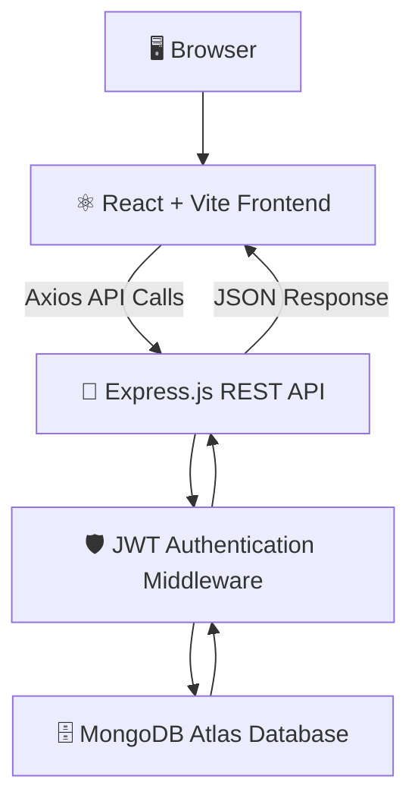
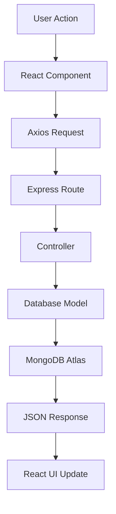
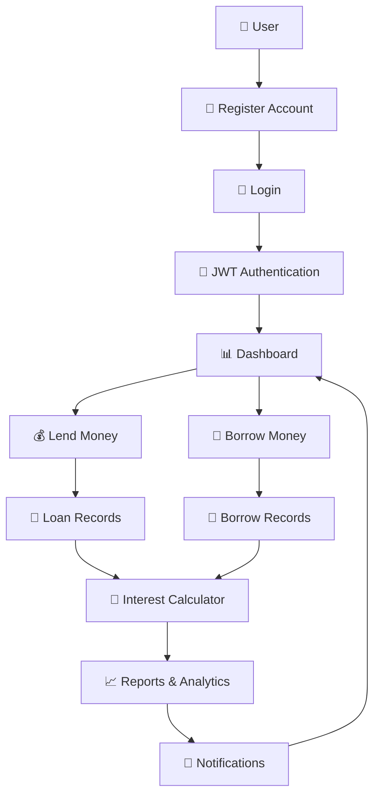
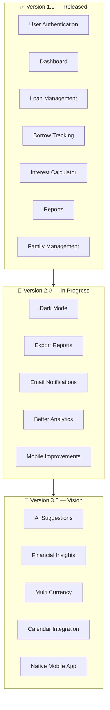

<div align="center">

<img src="data:image/svg+xml;base64,PHN2ZyB3aWR0aD0iMTI4MCIgaGVpZ2h0PSI0MjAiIHZpZXdCb3g9IjAgMCAxMjgwIDQyMCIgeG1sbnM9Imh0dHA6Ly93d3cudzMub3JnLzIwMDAvc3ZnIj4KICA8ZGVmcz4KICAgIDxsaW5lYXJHcmFkaWVudCBpZD0iYmciIHgxPSIwJSIgeTE9IjAlIiB4Mj0iMTAwJSIgeTI9IjEwMCUiPgogICAgICA8c3RvcCBvZmZzZXQ9IjAlIiBzdG9wLWNvbG9yPSIjMDUwNDBkIi8+CiAgICAgIDxzdG9wIG9mZnNldD0iNDUlIiBzdG9wLWNvbG9yPSIjMjIxZDRkIi8+CiAgICAgIDxzdG9wIG9mZnNldD0iMTAwJSIgc3RvcC1jb2xvcj0iIzBiMGExYSIvPgogICAgPC9saW5lYXJHcmFkaWVudD4KICAgIDxsaW5lYXJHcmFkaWVudCBpZD0iYWNjZW50IiB4MT0iMCUiIHkxPSIwJSIgeDI9IjEwMCUiIHkyPSIwJSI+CiAgICAgIDxzdG9wIG9mZnNldD0iMCUiIHN0b3AtY29sb3I9IiMwMGQ0ZmYiLz4KICAgICAgPHN0b3Agb2Zmc2V0PSI1MCUiIHN0b3AtY29sb3I9IiM0YWRlODAiLz4KICAgICAgPHN0b3Agb2Zmc2V0PSIxMDAlIiBzdG9wLWNvbG9yPSIjYTc4YmZhIi8+CiAgICA8L2xpbmVhckdyYWRpZW50PgogICAgPGxpbmVhckdyYWRpZW50IGlkPSJjb2luIiB4MT0iMCUiIHkxPSIwJSIgeDI9IjEwMCUiIHkyPSIxMDAlIj4KICAgICAgPHN0b3Agb2Zmc2V0PSIwJSIgc3RvcC1jb2xvcj0iI2ZmZTA4YSIvPgogICAgICA8c3RvcCBvZmZzZXQ9IjEwMCUiIHN0b3AtY29sb3I9IiNmNWE2MjMiLz4KICAgIDwvbGluZWFyR3JhZGllbnQ+CiAgICA8cmFkaWFsR3JhZGllbnQgaWQ9Imdsb3dHcmVlbiIgY3g9IjUwJSIgY3k9IjUwJSIgcj0iNTAlIj4KICAgICAgPHN0b3Agb2Zmc2V0PSIwJSIgc3RvcC1jb2xvcj0iIzRhZGU4MCIgc3RvcC1vcGFjaXR5PSIwLjMwIi8+CiAgICAgIDxzdG9wIG9mZnNldD0iMTAwJSIgc3RvcC1jb2xvcj0iIzRhZGU4MCIgc3RvcC1vcGFjaXR5PSIwIi8+CiAgICA8L3JhZGlhbEdyYWRpZW50PgogICAgPHJhZGlhbEdyYWRpZW50IGlkPSJnbG93Qmx1ZSIgY3g9IjUwJSIgY3k9IjUwJSIgcj0iNTAlIj4KICAgICAgPHN0b3Agb2Zmc2V0PSIwJSIgc3RvcC1jb2xvcj0iIzAwZDRmZiIgc3RvcC1vcGFjaXR5PSIwLjI4Ii8+CiAgICAgIDxzdG9wIG9mZnNldD0iMTAwJSIgc3RvcC1jb2xvcj0iIzAwZDRmZiIgc3RvcC1vcGFjaXR5PSIwIi8+CiAgICA8L3JhZGlhbEdyYWRpZW50PgogICAgPHJhZGlhbEdyYWRpZW50IGlkPSJnbG93UHVycGxlIiBjeD0iNTAlIiBjeT0iNTAlIiByPSI1MCUiPgogICAgICA8c3RvcCBvZmZzZXQ9IjAlIiBzdG9wLWNvbG9yPSIjYTc4YmZhIiBzdG9wLW9wYWNpdHk9IjAuMjUiLz4KICAgICAgPHN0b3Agb2Zmc2V0PSIxMDAlIiBzdG9wLWNvbG9yPSIjYTc4YmZhIiBzdG9wLW9wYWNpdHk9IjAiLz4KICAgIDwvcmFkaWFsR3JhZGllbnQ+CiAgPC9kZWZzPgoKICA8cmVjdCB3aWR0aD0iMTI4MCIgaGVpZ2h0PSI0MjAiIGZpbGw9InVybCgjYmcpIi8+CgogIDxjaXJjbGUgY3g9IjExMDAiIGN5PSI3MCIgcj0iMjAwIiBmaWxsPSJ1cmwoI2dsb3dHcmVlbikiLz4KICA8Y2lyY2xlIGN4PSIxMjAiIGN5PSIzNDAiIHI9IjE5MCIgZmlsbD0idXJsKCNnbG93Qmx1ZSkiLz4KICA8Y2lyY2xlIGN4PSI2NDAiIGN5PSI0MCIgcj0iMTYwIiBmaWxsPSJ1cmwoI2dsb3dQdXJwbGUpIi8+CgogIDxnIHN0cm9rZT0iI2ZmZmZmZiIgc3Ryb2tlLW9wYWNpdHk9IjAuMDQ1IiBzdHJva2Utd2lkdGg9IjEiPgogICAgPGxpbmUgeDE9IjAiIHkxPSI1MCIgeDI9IjEyODAiIHkyPSI1MCIvPgogICAgPGxpbmUgeDE9IjAiIHkxPSIxMDAiIHgyPSIxMjgwIiB5Mj0iMTAwIi8+CiAgICA8bGluZSB4MT0iMCIgeTE9IjM0MCIgeDI9IjEyODAiIHkyPSIzNDAiLz4KICAgIDxsaW5lIHgxPSIwIiB5MT0iMzgwIiB4Mj0iMTI4MCIgeTI9IjM4MCIvPgogIDwvZz4KCiAgPCEtLSB0b3AgcGlsbDogY2F0ZWdvcnkgdGFnIC0tPgogIDxyZWN0IHg9IjUzMCIgeT0iNDYiIHdpZHRoPSIyMjAiIGhlaWdodD0iMzQiIHJ4PSIxNyIgZmlsbD0iI2ZmZmZmZiIgZmlsbC1vcGFjaXR5PSIwLjA2IiBzdHJva2U9IiM0YWRlODAiIHN0cm9rZS1vcGFjaXR5PSIwLjUiLz4KICA8Y2lyY2xlIGN4PSI1NTIiIGN5PSI2MyIgcj0iNCIgZmlsbD0iIzRhZGU4MCIvPgogIDx0ZXh0IHg9IjU2NSIgeT0iNjgiIGZvbnQtZmFtaWx5PSJBcmlhbCwgSGVsdmV0aWNhLCBzYW5zLXNlcmlmIiBmb250LXNpemU9IjE0IiBmb250LXdlaWdodD0iNjAwIiBmaWxsPSIjYzljOWU4Ij5GSU5URUNIIMK3IE9QRU4gU09VUkNFPC90ZXh0PgoKICA8IS0tIGRlY29yYXRpdmUgYmFyIGNoYXJ0LCByaWdodCAtLT4KICA8ZyBvcGFjaXR5PSIwLjkiPgogICAgPHJlY3QgeD0iMTAzMCIgeT0iMjcwIiB3aWR0aD0iMjQiIGhlaWdodD0iNTUiIHJ4PSI1IiBmaWxsPSJ1cmwoI2FjY2VudCkiIG9wYWNpdHk9IjAuNSIvPgogICAgPHJlY3QgeD0iMTA2NiIgeT0iMjQwIiB3aWR0aD0iMjQiIGhlaWdodD0iODUiIHJ4PSI1IiBmaWxsPSJ1cmwoI2FjY2VudCkiIG9wYWNpdHk9IjAuNjUiLz4KICAgIDxyZWN0IHg9IjExMDIiIHk9IjIwMCIgd2lkdGg9IjI0IiBoZWlnaHQ9IjEyNSIgcng9IjUiIGZpbGw9InVybCgjYWNjZW50KSIgb3BhY2l0eT0iMC44Ii8+CiAgICA8cmVjdCB4PSIxMTM4IiB5PSIxNjAiIHdpZHRoPSIyNCIgaGVpZ2h0PSIxNjUiIHJ4PSI1IiBmaWxsPSJ1cmwoI2FjY2VudCkiLz4KICA8L2c+CgogIDwhLS0gY29pbiBtb3RpZiwgbGVmdCAtLT4KICA8ZyB0cmFuc2Zvcm09InRyYW5zbGF0ZSgxMzAsMjU1KSI+CiAgICA8Y2lyY2xlIGN4PSIwIiBjeT0iMCIgcj0iNDQiIGZpbGw9InVybCgjY29pbikiLz4KICAgIDxjaXJjbGUgY3g9IjAiIGN5PSIwIiByPSI0NCIgZmlsbD0ibm9uZSIgc3Ryb2tlPSIjZmZmZmZmIiBzdHJva2Utb3BhY2l0eT0iMC4zNSIgc3Ryb2tlLXdpZHRoPSIyIi8+CiAgICA8dGV4dCB4PSIwIiB5PSIxMyIgZm9udC1mYW1pbHk9IkFyaWFsLCBIZWx2ZXRpY2EsIHNhbnMtc2VyaWYiIGZvbnQtc2l6ZT0iNDAiIGZvbnQtd2VpZ2h0PSI3MDAiIGZpbGw9IiM3YTRhMDAiIHRleHQtYW5jaG9yPSJtaWRkbGUiPiQ8L3RleHQ+CiAgPC9nPgogIDxnIHRyYW5zZm9ybT0idHJhbnNsYXRlKDIxMCwyMDUpIiBvcGFjaXR5PSIwLjg1Ij4KICAgIDxjaXJjbGUgY3g9IjAiIGN5PSIwIiByPSIyNiIgZmlsbD0idXJsKCNjb2luKSIvPgogICAgPHRleHQgeD0iMCIgeT0iOCIgZm9udC1mYW1pbHk9IkFyaWFsLCBIZWx2ZXRpY2EsIHNhbnMtc2VyaWYiIGZvbnQtc2l6ZT0iMjQiIGZvbnQtd2VpZ2h0PSI3MDAiIGZpbGw9IiM3YTRhMDAiIHRleHQtYW5jaG9yPSJtaWRkbGUiPiQ8L3RleHQ+CiAgPC9nPgoKICA8IS0tIHRpdGxlIC0tPgogIDx0ZXh0IHg9IjY0MCIgeT0iMjAwIiBmb250LWZhbWlseT0iQXJpYWwsIEhlbHZldGljYSwgc2Fucy1zZXJpZiIgZm9udC1zaXplPSI4MCIgZm9udC13ZWlnaHQ9IjgwMCIgZmlsbD0iI2ZmZmZmZiIgdGV4dC1hbmNob3I9Im1pZGRsZSIgbGV0dGVyLXNwYWNpbmc9IjEiPgogICAgTGVuZDx0c3BhbiBmaWxsPSIjNGFkZTgwIj5UcmFjazwvdHNwYW4+CiAgPC90ZXh0PgoKICA8dGV4dCB4PSI2NDAiIHk9IjI0OCIgZm9udC1mYW1pbHk9IkFyaWFsLCBIZWx2ZXRpY2EsIHNhbnMtc2VyaWYiIGZvbnQtc2l6ZT0iMjMiIGZvbnQtd2VpZ2h0PSI0MDAiIGZpbGw9IiNjOWM5ZTgiIHRleHQtYW5jaG9yPSJtaWRkbGUiPgogICAgVGhlIG1vZGVybiB3YXkgdG8gbWFuYWdlIG1vbmV5IHlvdSBsZW5kIGFuZCBib3Jyb3cKICA8L3RleHQ+CgogIDxyZWN0IHg9IjUwMCIgeT0iMjcyIiB3aWR0aD0iMjgwIiBoZWlnaHQ9IjQiIHJ4PSIyIiBmaWxsPSJ1cmwoI2FjY2VudCkiLz4KCiAgPCEtLSBmZWF0dXJlIGNoaXBzIC0tPgogIDxnIGZvbnQtZmFtaWx5PSJBcmlhbCwgSGVsdmV0aWNhLCBzYW5zLXNlcmlmIiBmb250LXNpemU9IjE0IiBmb250LXdlaWdodD0iNjAwIiBmaWxsPSIjZTVlN2ViIj4KICAgIDxnIHRyYW5zZm9ybT0idHJhbnNsYXRlKDM1MCwzMjApIj4KICAgICAgPHJlY3QgeD0iMCIgeT0iLTIwIiB3aWR0aD0iMTUwIiBoZWlnaHQ9IjM0IiByeD0iMTciIGZpbGw9IiNmZmZmZmYiIGZpbGwtb3BhY2l0eT0iMC4wNiIvPgogICAgICA8dGV4dCB4PSI3NSIgeT0iMiIgdGV4dC1hbmNob3I9Im1pZGRsZSI+8J+UkCBKV1QgU2VjdXJlZDwvdGV4dD4KICAgIDwvZz4KICAgIDxnIHRyYW5zZm9ybT0idHJhbnNsYXRlKDUyMCwzMjApIj4KICAgICAgPHJlY3QgeD0iMCIgeT0iLTIwIiB3aWR0aD0iMTUwIiBoZWlnaHQ9IjM0IiByeD0iMTciIGZpbGw9IiNmZmZmZmYiIGZpbGwtb3BhY2l0eT0iMC4wNiIvPgogICAgICA8dGV4dCB4PSI3NSIgeT0iMiIgdGV4dC1hbmNob3I9Im1pZGRsZSI+8J+TiiBMaXZlIERhc2hib2FyZDwvdGV4dD4KICAgIDwvZz4KICAgIDxnIHRyYW5zZm9ybT0idHJhbnNsYXRlKDY5MCwzMjApIj4KICAgICAgPHJlY3QgeD0iMCIgeT0iLTIwIiB3aWR0aD0iMTUwIiBoZWlnaHQ9IjM0IiByeD0iMTciIGZpbGw9IiNmZmZmZmYiIGZpbGwtb3BhY2l0eT0iMC4wNiIvPgogICAgICA8dGV4dCB4PSI3NSIgeT0iMiIgdGV4dC1hbmNob3I9Im1pZGRsZSI+8J+nriBBdXRvIEludGVyZXN0PC90ZXh0PgogICAgPC9nPgogICAgPGcgdHJhbnNmb3JtPSJ0cmFuc2xhdGUoODYwLDMyMCkiPgogICAgICA8cmVjdCB4PSIwIiB5PSItMjAiIHdpZHRoPSIxNTAiIGhlaWdodD0iMzQiIHJ4PSIxNyIgZmlsbD0iI2ZmZmZmZiIgZmlsbC1vcGFjaXR5PSIwLjA2Ii8+CiAgICAgIDx0ZXh0IHg9Ijc1IiB5PSIyIiB0ZXh0LWFuY2hvcj0ibWlkZGxlIj7imqEgTUVSTiBTdGFjazwvdGV4dD4KICAgIDwvZz4KICA8L2c+Cjwvc3ZnPgo=" alt="LendTrack — Smart Loan & Borrow Management" width="100%" />

<br/><br/>


<h1>LendTrack</h1>

<h3>💸 The modern way to manage money you lend and borrow</h3>


<br/><br/>

<p>
  <a href="https://boobesh-lend-track.vercel.app/"></a>
  <a href="https://github.com/BoobeshPalanisamy0612/LendTrack"></a>
  <a href="https://github.com/BoobeshPalanisamy0612/LendTrack/issues/new"></a>
  <a href="https://github.com/BoobeshPalanisamy0612/LendTrack/issues/new"></a>
</p>

<br/>

<p>
  
  
  
  
</p>
<p>
  
  
  
  
  
</p>

<br/>

<sub>Built with ❤️ by <a href="https://github.com/BoobeshPalanisamy0612"><b>Boobesh Palanisamy</b></a> — full stack MERN developer</sub>

</div>

<br/>

---

<div align="center">

## 📑 Table of Contents

</div>

<table align="center">
<tr>
<td valign="top" width="33%">

**Overview**
- [About the Project](#-about-the-project)
- [Why LendTrack](#-why-lendtrack)
- [Features](#-features)
- [Screenshots](#-screenshots)

</td>
<td valign="top" width="33%">

**Build & Run**
- [Tech Stack](#-tech-stack)
- [Folder Structure](#-folder-structure)
- [Installation](#-installation)
- [Environment Variables](#-environment-variables)

</td>
<td valign="top" width="33%">

**Deep Dive**
- [System Architecture](#-system-architecture)
- [Application Workflow](#-application-workflow)
- [REST API Overview](#-rest-api-overview)
- [Database Collections](#-database-collections)

</td>
</tr>
<tr>
<td valign="top" width="33%">

**Quality**
- [Security Features](#-security-features)
- [Performance Optimizations](#-performance-optimizations)
- [Design Principles](#-design-principles)

</td>
<td valign="top" width="33%">

**What's Next**
- [Future Enhancements](#-future-enhancements)
- [Roadmap](#-roadmap)
- [Contributing](#-contributing)

</td>
<td valign="top" width="33%">

**Wrap Up**
- [Author](#-author)
- [License](#-license)
- [Support](#-support)

</td>
</tr>
</table>

<br/>

---

<div align="center">

## 🧭 About the Project

</div>

<br/>

**LendTrack** is a full-stack MERN application that replaces messy notebooks, spreadsheets, and chat threads with a single, secure source of truth for personal lending and borrowing.

Whether you're splitting rent with roommates, tracking a loan to a family member, or managing informal credit as a freelancer, LendTrack gives you a clean dashboard to log transactions, calculate interest, follow due dates, and understand your financial position at a glance.

<div align="center">

| 🎯 Built For | 💡 Solves |
|:---:|:---:|
| Individuals, families, friends, freelancers, and small businesses | Forgotten repayments, scattered records, and manual interest math |

</div>

<br/>

---

<div align="center">

## ⭐ Why LendTrack

</div>

<br/>

<table align="center">
<tr>
<td width="50%" valign="top">

### 🚫 The Old Way
- Loans tracked in random notebooks
- Interest calculated by hand
- Due dates forgotten entirely
- No visibility into who owes what
- Records lost across chats and screenshots

</td>
<td width="50%" valign="top">

### ✅ The LendTrack Way
- Every transaction in one dashboard
- Interest calculated automatically
- Reminders before repayments are due
- Real-time financial summaries
- Secure, centralized, always accessible

</td>
</tr>
</table>

<br/>

---

<div align="center">

## 🚀 Features

</div>

<br/>

<table align="center">
<tr>
<td width="33%" valign="top" align="center">

### 🔐
**Secure Authentication**
<br/>
JWT-based login & registration with encrypted, bcrypt-hashed passwords.

</td>
<td width="33%" valign="top" align="center">

### 📊
**Dashboard Analytics**
<br/>
Real-time snapshot of what you lend, owe, and expect to receive.

</td>
<td width="33%" valign="top" align="center">

### 💸
**Loan Management**
<br/>
Create, edit, and track every lending record with full history.

</td>
</tr>
<tr>
<td width="33%" valign="top" align="center">

### 💳
**Borrow Tracking**
<br/>
Log money you've borrowed and monitor repayment progress.

</td>
<td width="33%" valign="top" align="center">

### 🧮
**Interest Calculator**
<br/>
Automatic interest and total payable computation, no manual math.

</td>
<td width="33%" valign="top" align="center">

### 📈
**Reports**
<br/>
Summary reports that turn raw transactions into clear insight.

</td>
</tr>
<tr>
<td width="33%" valign="top" align="center">

### 🔔
**Smart Notifications**
<br/>
Stay ahead of upcoming and overdue repayments automatically.

</td>
<td width="33%" valign="top" align="center">

### 👨‍👩‍👧
**Family Management**
<br/>
Organize loans by the family members and contacts involved.

</td>
<td width="33%" valign="top" align="center">

### 📱
**Responsive UI**
<br/>
A polished experience across desktop, tablet, and mobile.

</td>
</tr>
</table>

<br/>

---

<div align="center">

## 🖼️ Screenshots

*Preview images below — replace the placeholders in `/assets` with real captures once available.*

<br/>

<table>
<tr>
<td align="center" width="50%">
<b>🏠 Home</b><br/>

</td>
<td align="center" width="50%">
<b>🔐 Login</b><br/>

</td>
</tr>
<tr>
<td align="center" width="50%">
<b>📊 Dashboard</b><br/>

</td>
<td align="center" width="50%">
<b>💸 Loan Management</b><br/>

</td>
</tr>
<tr>
<td align="center" width="50%">
<b>💳 Borrow Management</b><br/>

</td>
<td align="center" width="50%">
<b>🧮 Interest Calculator</b><br/>

</td>
</tr>
<tr>
<td align="center" width="50%">
<b>📈 Reports</b><br/>

</td>
<td align="center" width="50%">
<b>🔔 Notifications</b><br/>

</td>
</tr>
<tr>
<td align="center" colspan="2">
<b>👤 Profile</b><br/>

</td>
</tr>
</table>

</div>

<br/>

---

<div align="center">

## 🛠️ Tech Stack

</div>

<br/>

<div align="center">

**Frontend**


**Backend**


**Database**


**Deployment**


</div>

<br/>

<details>
<summary><strong>📊 View detailed tech breakdown by layer</strong></summary>

<br/>

| Layer | Technology | Purpose |
|---|---|---|
| Frontend | React.js | User Interface |
| Frontend | Vite | Build Tool |
| Frontend | React Router | Navigation |
| Frontend | Axios | API Communication |
| Frontend | CSS3 | Styling |
| Frontend | React Icons | Icons |
| Backend | Node.js | Runtime |
| Backend | Express.js | REST API |
| Backend | JWT | Authentication |
| Backend | bcrypt | Password Encryption |
| Database | MongoDB Atlas | Cloud Database |
| Database | Mongoose | Database ODM |
| Deployment | Vercel | Frontend Hosting |
| Deployment | Render | Backend Hosting |

</details>

<br/>

---

<div align="center">

## 📂 Folder Structure

</div>

<br/>

```text
LendTrack/
│
├── client/                  # React + Vite frontend
│   ├── public/
│   ├── src/
│   │   ├── assets/
│   │   ├── components/
│   │   ├── layouts/
│   │   ├── pages/
│   │   ├── context/
│   │   ├── hooks/
│   │   ├── services/
│   │   ├── utils/
│   │   ├── App.jsx
│   │   └── main.jsx
│   ├── package.json
│   └── vite.config.js
│
├── server/                  # Node.js + Express backend
│   ├── config/
│   ├── controllers/
│   ├── middleware/
│   ├── models/
│   ├── routes/
│   ├── utils/
│   ├── package.json
│   └── server.js
│
├── README.md
└── .gitignore
```

<br/>

---

<div align="center">

## ⚙️ Installation

</div>

<br/>

<details open>
<summary><strong>📋 Prerequisites</strong></summary>

<br/>

| Requirement | Version |
|---|---|
| Node.js | v18+ |
| npm | Latest |
| Git | Latest |
| MongoDB Atlas Account | Required |

</details>

<br/>

**1. Clone the repository**

```bash
git clone https://github.com/BoobeshPalanisamy0612/LendTrack.git
cd LendTrack
```

**2. Install frontend dependencies**

```bash
cd client
npm install
```

**3. Install backend dependencies**

```bash
cd ../server
npm install
```

**4. Configure environment variables** — see [Environment Variables](#-environment-variables)

**5. Run the project**

<table>
<tr>
<td valign="top" width="50%">

**Backend**
```bash
cd server
npm run dev
```
→ `http://localhost:5000`

</td>
<td valign="top" width="50%">

**Frontend**
```bash
cd client
npm run dev
```
→ `http://localhost:5173`

</td>
</tr>
</table>

<br/>

---

<div align="center">

## 🔑 Environment Variables

</div>

<br/>

<details>
<summary><strong>📁 Frontend — <code>client/.env</code></strong></summary>

<br/>

```env
VITE_API_URL=http://localhost:5000/api
```

</details>

<details>
<summary><strong>📁 Backend — <code>server/.env</code></strong></summary>

<br/>

```env
PORT=5000
MONGO_URI=your_mongodb_connection_string
JWT_SECRET=your_secret_key
CLIENT_URL=http://localhost:5173
```

</details>

<br/>

> ⚠️ **Never commit your `.env` file.** Keep secrets out of source control.

<br/>

---

<div align="center">

## 🏗️ System Architecture

</div>

<br/>



<br/>

<details>
<summary><strong>🔄 View detailed request lifecycle</strong></summary>

<br/>



</details>

<br/>

---

<div align="center">

## 🔄 Application Workflow

</div>

<br/>



<br/>

---

<div align="center">

## 📡 REST API Overview

</div>

<br/>

<details open>
<summary><strong>🔐 Authentication</strong></summary>

<br/>

| Method | Endpoint | Description |
|---|---|---|
| `POST` | `/api/auth/register` | Register a new user |
| `POST` | `/api/auth/login` | Login user |
| `GET` | `/api/auth/profile` | Get logged-in user |

</details>

<details>
<summary><strong>📊 Dashboard</strong></summary>

<br/>

| Method | Endpoint | Description |
|---|---|---|
| `GET` | `/api/dashboard` | Dashboard summary |

</details>

<details>
<summary><strong>💸 Loan Management</strong></summary>

<br/>

| Method | Endpoint | Description |
|---|---|---|
| `GET` | `/api/loans` | Get all loans |
| `POST` | `/api/loans` | Add new loan |
| `PUT` | `/api/loans/:id` | Update loan |
| `DELETE` | `/api/loans/:id` | Delete loan |

</details>

<details>
<summary><strong>💳 Borrow Management</strong></summary>

<br/>

| Method | Endpoint | Description |
|---|---|---|
| `GET` | `/api/borrow` | Get borrow records |
| `POST` | `/api/borrow` | Add borrow record |
| `PUT` | `/api/borrow/:id` | Update borrow |
| `DELETE` | `/api/borrow/:id` | Delete borrow |

</details>

<details>
<summary><strong>👨‍👩‍👧 Family Management</strong></summary>

<br/>

| Method | Endpoint | Description |
|---|---|---|
| `GET` | `/api/family` | List family members |
| `POST` | `/api/family` | Add family member |
| `PUT` | `/api/family/:id` | Update member |
| `DELETE` | `/api/family/:id` | Remove member |

</details>

<details>
<summary><strong>🔔 Notifications & 📈 Reports</strong></summary>

<br/>

| Method | Endpoint | Description |
|---|---|---|
| `GET` | `/api/notifications` | View notifications |
| `GET` | `/api/reports` | Financial reports |

</details>

<br/>

---

<div align="center">

## 🗄️ Database Collections

</div>

<br/>

<table align="center">
<tr>
<td valign="top" width="25%">

**👤 Users**
- name
- email
- password
- createdAt

</td>
<td valign="top" width="25%">

**💸 Loans**
- lender
- borrower
- amount
- interest
- dueDate
- status
- paymentHistory

</td>
<td valign="top" width="25%">

**👨‍👩‍👧 Family**
- name
- relationship
- phone
- linkedLoans

</td>
<td valign="top" width="25%">

**🔔 Notifications**
- title
- message
- read
- createdAt

</td>
</tr>
</table>

<br/>

---

<div align="center">

## 🔒 Security Features

</div>

<br/>

| Measure | Description |
|---|---|
| 🔐 JWT Authentication | Stateless, token-based session management |
| 🛡️ Protected Routes | Sensitive endpoints gated behind valid tokens |
| 🔑 Password Hashing | Passwords encrypted using **bcrypt** |
| 🌐 Secure REST APIs | Consistent request/response contracts |
| 🧩 Auth Middleware | Centralized token verification |
| ✅ Input Validation | Guards against malformed/malicious input |
| 🚫 Injection Protection | Sanitized queries via Mongoose |
| 🗝️ Env Configuration | Secrets kept out of source control |

<br/>

---

<div align="center">

## ⚡ Performance Optimizations

</div>

<br/>

<table align="center">
<tr>
<td width="25%" align="center">♻️<br/><b>Reusable Components</b></td>
<td width="25%" align="center">⚡<br/><b>Vite Fast Refresh</b></td>
<td width="25%" align="center">📡<br/><b>Optimized API Calls</b></td>
<td width="25%" align="center">🧱<br/><b>Modular Architecture</b></td>
</tr>
<tr>
<td width="25%" align="center">🗄️<br/><b>Efficient Queries</b></td>
<td width="25%" align="center">🪶<br/><b>Lightweight UI</b></td>
<td width="25%" align="center">📱<br/><b>Responsive Layout</b></td>
<td width="25%" align="center">🌀<br/><b>Lazy Loading Ready</b></td>
</tr>
</table>

<br/>

---

<div align="center">

## 🎨 Design Principles

</div>

<br/>

| Principle | Description |
|---|---|
| 🎯 Minimal UI | No clutter — only what the user needs, when they need it |
| 📏 Consistent Spacing | Predictable visual rhythm across pages |
| 🧩 Responsive Grid | Adapts fluidly across breakpoints |
| ♻️ Reusable Components | Shared UI primitives across the app |
| 🎨 Accessible Palette | Legible contrast for financial data |
| 🔤 Clear Typography | Strong hierarchy for numbers & labels |
| 💳 Modern Cards | Digestible, elevated information blocks |
| 📊 Dashboard-First | Key insights surfaced immediately on login |

<br/>

---

<div align="center">

## 🚀 Future Enhancements

</div>

<br/>

| Feature | Status |
|---|:---:|
| 📱 Progressive Web App (PWA) | ⏳ Planned |
| 🌙 Dark Mode | ⏳ Planned |
| 💳 EMI Calculator | ⏳ Planned |
| 📅 Google Calendar Integration | ⏳ Planned |
| 📧 Email Payment Reminders | ⏳ Planned |
| 📲 SMS Notifications | ⏳ Planned |
| 📤 Export to Excel & PDF | ⏳ Planned |
| ☁️ Cloud File Attachments | ⏳ Planned |
| 💱 Multi-Currency Support | ⏳ Planned |
| 🌍 Multi-Language Support | ⏳ Planned |
| 🤖 AI Payment Prediction | 🔮 Future Vision |
| 🏦 Bank Account Integration | 🔮 Future Vision |
| 📱 Native Mobile App | 🔮 Future Vision |

<br/>

---

<div align="center">

## 🗺️ Roadmap

</div>

<br/>



<br/>

---

<div align="center">

## 🤝 Contributing

Contributions make the open-source community amazing. Any contribution is **greatly appreciated**.

</div>

<br/>

1. Fork the repository
2. Create your feature branch
   ```bash
   git checkout -b feature/AmazingFeature
   ```
3. Commit your changes
   ```bash
   git commit -m "Add Amazing Feature"
   ```
4. Push to your branch
   ```bash
   git push origin feature/AmazingFeature
   ```
5. Open a [Pull Request](https://github.com/BoobeshPalanisamy0612/LendTrack/pulls)

<br/>

<details>
<summary><strong>📋 Coding Guidelines</strong></summary>

<br/>

- Follow consistent coding standards
- Keep components reusable and modular
- Write meaningful commit messages
- Test features before submitting
- Avoid unnecessary dependencies
- Maintain a clean folder structure

</details>

<details>
<summary><strong>🐞 Found a bug?</strong></summary>

<br/>

1. Search [existing issues](https://github.com/BoobeshPalanisamy0612/LendTrack/issues) first
2. [Open a new issue](https://github.com/BoobeshPalanisamy0612/LendTrack/issues/new) with clear reproduction steps
3. Include screenshots, expected vs. actual behavior, browser & OS

</details>

<details>
<summary><strong>💡 Have a feature request?</strong></summary>

<br/>

[Open a feature request](https://github.com/BoobeshPalanisamy0612/LendTrack/issues/new) describing the problem, your proposed solution, and expected benefit.

</details>

<br/>

---

<div align="center">

## 👨‍💻 Author

<br/>


### Boobesh Palanisamy

**UI/UX Designer • React Frontend Developer • MERN Stack Developer**

*Building modern, responsive, and user-friendly web applications with a passion for intuitive UX and scalable systems.*

<br/>

<p>
  <a href="https://boobeshpalanisamy0612.github.io/Portfolio/"></a>
  <a href="https://github.com/BoobeshPalanisamy0612"></a>
  <a href="#"></a>
  <a href="#"></a>
</p>

<sub>💡 LinkedIn and Email link out to <code>#</code> for now — swap in your real profile URL and a <code>mailto:</code> link to activate them.</sub>

</div>

<br/>

---

<div align="center">

## 📜 License

This project is licensed under the **MIT License**.

You're free to ✅ use · ✅ modify · ✅ distribute · ✅ fork · ✅ learn from this project.
Please retain the original license notice when redistributing.

</div>

<br/>

---

<div align="center">

## 💖 Support

If LendTrack helped you or inspired your own project, consider supporting it:

⭐ **Star** the repo &nbsp;·&nbsp; 🍴 **Fork** it &nbsp;·&nbsp; 🛠️ **Contribute** &nbsp;·&nbsp; 🐛 **Report bugs** &nbsp;·&nbsp; 📢 **Share it**

</div>

<br/>

---

<div align="center">

## ⭐ Star This Repository

**It genuinely helps** — every star motivates future development and helps other developers discover the project.

<br/>

<a href="https://github.com/BoobeshPalanisamy0612/LendTrack">
  
</a>

<br/><br/>

### 💰 LendTrack
**Track Smarter. Lend Better. Stay Organized.**

Made with ❤️ by **[Boobesh Palanisamy](https://github.com/BoobeshPalanisamy0612)**

</div>
